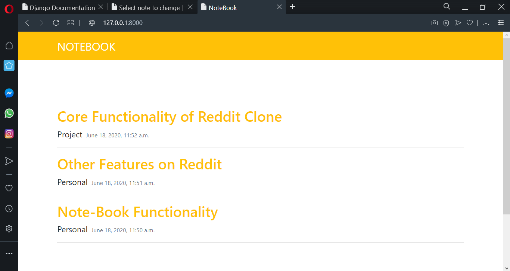
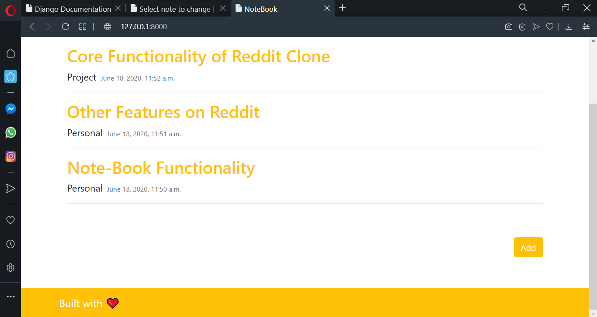

#NoteBook
---------------------------
It’s human to have many thoughts and ideas in a day, but it’s also human to forget. One way to work around forgetting things is to jot them down before they disappear into thin air. While some of forgotten thoughts and ideas may be trivial, some can be quite powerful.

This is where a Notebook comes in: Notes make it easier to jot things down. The Notebook project idea is something similar. It allows users to jot things down, making them accessible anywhere, since it’s a web application.

With the Notebook, people can now jot things down anywhere, without the fear of forgetting things or misplacing the notes—which is a possibility with physical notes.


<br>
The interface is as shown:





<br>

#FEATURES
* User can Add note.
* User can View note.
* User can Edit/Update note.
* User can Delete note.
* Responsive UI (Bootstrap4)

<br>
To get it running on your local machine, follow the steps below:

1. Run the commands below in your terminal:

```
git clone https://github.com/israelvictory/NoteBook.git
```

2. change directory to diary:

```
cd Note-Book/notebook
```

3. Install the requirements with the command below:
```
pip install -r requirements.txt
```

4. Run the development server with
```
python manage.py runserver
```

5. Launch your browser and navigate to:
```
http://127.0.0.1:8000
```